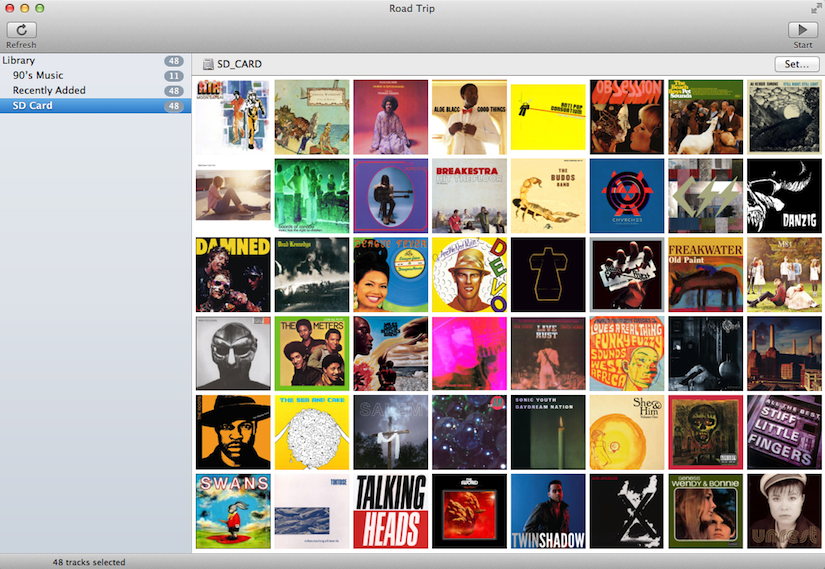

# Road Trip



### Features

* Reads your iTunes playlists
* Conversion to MP3
* M3U playlist creation
* Album artwork scaling

### Building

There's a pre-built copy of ffmpeg included as well as a script to download and build a new copy. You'll need to install cocopods as well.

**IMPORTANT:** Road Trip used the iTunes framework which requires sandboxing. You'll need to have valid Devleoper ID signing credentials in order to build and run Road Trip. **I can't provide you with a pre-built app as I no longer have Developer ID signing credentials.**

### LICENSE

```
The MIT License (MIT)

Copyright (c) 2015 James Moore

Permission is hereby granted, free of charge, to any person obtaining a copy
of this software and associated documentation files (the "Software"), to deal
in the Software without restriction, including without limitation the rights
to use, copy, modify, merge, publish, distribute, sublicense, and/or sell
copies of the Software, and to permit persons to whom the Software is
furnished to do so, subject to the following conditions:

The above copyright notice and this permission notice shall be included in all
copies or substantial portions of the Software.

THE SOFTWARE IS PROVIDED "AS IS", WITHOUT WARRANTY OF ANY KIND, EXPRESS OR
IMPLIED, INCLUDING BUT NOT LIMITED TO THE WARRANTIES OF MERCHANTABILITY,
FITNESS FOR A PARTICULAR PURPOSE AND NONINFRINGEMENT. IN NO EVENT SHALL THE
AUTHORS OR COPYRIGHT HOLDERS BE LIABLE FOR ANY CLAIM, DAMAGES OR OTHER
LIABILITY, WHETHER IN AN ACTION OF CONTRACT, TORT OR OTHERWISE, ARISING FROM,
OUT OF OR IN CONNECTION WITH THE SOFTWARE OR THE USE OR OTHER DEALINGS IN THE
SOFTWARE.
```
